# Guide d'Implémentation WhatsApp Business pour Postly-AI

## 1. Schéma d'Architecture


## 2. Diagrammes de Séquence

### 2.1 Message WhatsApp → IA → Réponse

```mermaid
sequenceDiagram
    participant U as Utilisateur WA
    participant WA as WhatsApp API
    participant W as /api/whatsapp/webhook
    participant C as Credits Service
    participant AI as AI Pipeline
    participant DB as Database
    
    U->>WA: Envoie message "Crée un post promo pour Instagram"
    WA->>W: POST webhook (signature vérifiée)
    W->>DB: Recherche utilisateur par phone
    W->>C: Vérifie crédits disponibles
    C->>DB: SELECT credits FROM User
    DB-->>C: credits: 5
    C-->>W: Crédits OK
    
    W->>AI: Parse intent
    AI->>AI: Prompt builder
    AI->>AI: Generate 3 variants
    AI-->>W: 3 posts générés
    
    W->>C: Décrémente 1 crédit
    C->>DB: BEGIN TRANSACTION
    C->>DB: UPDATE User SET credits = credits - 1
    C->>DB: INSERT CreditLedger (delta: -1, reason: "whatsapp_generation")
    C->>DB: COMMIT
    C-->>W: Crédit débité
    
    W->>WA: Envoie réponse avec 3 posts
    WA->>U: Affiche les posts générés
```



### 2.2 Parcours OTP WA-first (LOGIN)

```mermaid
sequenceDiagram
    participant U as Utilisateur WA
    participant WA as WhatsApp API
    participant W as /api/whatsapp/webhook
    participant O as OTP Service
    participant A as /api/auth/verify-otp
    participant JWT as NextAuth
    
    U->>WA: Envoie "LOGIN"
    WA->>W: POST webhook
    W->>O: Génère OTP pour phone
    O->>O: Hash OTP + salt
    O->>DB: INSERT OtpChallenge (phone, codeHash, purpose: "login")
    O->>WA: Envoie OTP via message libre
    WA->>U: "Votre code: 123456"
    
    U->>A: POST /api/auth/verify-otp {phone, code}
    A->>O: Vérifie OTP
    O->>DB: SELECT OtpChallenge WHERE phone AND consumed=false
    O->>O: Compare hash(code) avec codeHash
    O->>DB: UPDATE OtpChallenge SET consumed=true
    O-->>A: OTP valide
    
    A->>JWT: Crée session JWT
    JWT-->>A: Token généré
    A-->>U: Session créée, redirection dashboard
```



### 2.3 Parcours Web-first (LINK)

```mermaid
sequenceDiagram
    participant U as Utilisateur Web
    participant W as Web App
    participant A as /api/auth/request-otp
    participant WA as WhatsApp API
    participant U2 as Utilisateur WA
    
    U->>W: Crée compte web + saisit numéro WA
    W->>A: POST /api/auth/request-otp {userId, phone}
    A->>O: Génère OTP pour linkage
    O->>DB: INSERT OtpChallenge (userId, phone, purpose: "link")
    A->>WA: Envoie OTP via template
    WA->>U2: "Code de liaison: 123456"
    
    U2->>A: POST /api/auth/verify-otp {phone, code}
    A->>O: Vérifie OTP
    O-->>A: OTP valide
    A->>DB: UPDATE User SET waPhoneE164=phone, waLinkedAt=NOW()
    A-->>U: Numéro WhatsApp lié avec succès
```



## 3. Schéma Prisma

```prisma
// Ajouts au schema.prisma existant

model User {
  id            String   @id @default(cuid())
  email         String?  @unique
  passwordHash  String?
  credits       Int      @default(5)
  
  // WhatsApp fields
  waPhoneE164   String?  @unique
  waUserId      String?  @unique
  waLinkedAt    DateTime?
  waPreferredLang String? @default("fr")
  
  createdAt     DateTime @default(now())
  updatedAt     DateTime @updatedAt
  
  // Relations
  otpChallenges OtpChallenge[]
  creditLedger  CreditLedger[]
  generations   Generation[]
  
  @@index([waPhoneE164])
  @@index([waUserId])
}

model OtpChallenge {
  id        String   @id @default(cuid())
  userId    String?
  phoneE164 String
  codeHash  String
  purpose   OtpPurpose @default(LOGIN)
  consumed  Boolean  @default(false)
  expiresAt DateTime
  createdAt DateTime @default(now())
  
  // Relations
  user User? @relation(fields: [userId], references: [id])
  
  @@index([phoneE164, consumed, expiresAt])
  @@index([userId, consumed])
}

model CreditLedger {
  id       String   @id @default(cuid())
  userId   String
  delta    Int      // -1 pour débit, +1 pour crédit
  reason   String   // "whatsapp_generation", "web_generation", "purchase", "refund"
  createdAt DateTime @default(now())
  
  // Relations
  user User @relation(fields: [userId], references: [id])
  
  @@index([userId, createdAt])
  @@index([reason, createdAt])
}

enum OtpPurpose {
  LOGIN
  LINK
  SIGNUP
}
```

## 4. Endpoints Next.js

### 4.1 POST /api/whatsapp/webhook

```typescript
// app/api/whatsapp/webhook/route.ts
import { NextRequest, NextResponse } from 'next/server';
import { prisma } from '@/lib/prisma';
import { verifyTwilioSignature, verifyMetaSignature } from '@/lib/wa';
import { requireCredits, decrementWithLedgerTX } from '@/lib/credits';
import { detectLanguageSmart } from '@/lib/lang';
import { openai } from '@/lib/ai/openai';
import { PARSE_INTENT_SYSTEM_PROMPT, PROMPT_BUILDER_SYSTEM_PROMPT, GENERATE_SYSTEM_PROMPT } from '@/lib/ai/prompts';
import { sendWhatsAppMessage } from '@/lib/wa';

export async function POST(req: NextRequest) {
  try {
    const provider = process.env.WHATSAPP_PROVIDER || 'twilio';
    
    // Vérification signature
    if (provider === 'twilio') {
      const isValid = await verifyTwilioSignature(req);
      if (!isValid) {
        return NextResponse.json({ error: 'Invalid signature' }, { status: 401 });
      }
    } else {
      const isValid = await verifyMetaSignature(req);
      if (!isValid) {
        return NextResponse.json({ error: 'Invalid signature' }, { status: 401 });
      }
    }

    const body = await req.json();
    const { message, from, to } = provider === 'twilio' 
      ? parseTwilioWebhook(body)
      : parseMetaWebhook(body);

    if (!message || !from) {
      return NextResponse.json({ error: 'Invalid payload' }, { status: 400 });
    }

    // Normaliser numéro E.164
    const phoneE164 = normalizePhone(from);
    
    // Rechercher utilisateur
    let user = await prisma.user.findUnique({
      where: { waPhoneE164: phoneE164 }
    });

    // Si pas d'utilisateur, créer un compte temporaire
    if (!user) {
      user = await prisma.user.create({
        data: {
          waPhoneE164: phoneE164,
          waUserId: phoneE164, // ID temporaire
          credits: 0, // Pas de crédits gratuits pour les nouveaux utilisateurs WA
          waPreferredLang: 'fr'
        }
      });
    }

    // Router les commandes
    const command = message.toLowerCase().trim();
    
    switch (command) {
      case 'help':
        return handleHelp(phoneE164);
      
      case 'balance':
        return handleBalance(user, phoneE164);
      
      case 'lang':
        return handleLanguage(phoneE164);
      
      case command.match(/^gen\s+(.+)$/)?.input:
        const brief = command.replace(/^gen\s+/, '');
        return handleGeneration(user, brief, phoneE164);
      
      case 'login':
        return handleLoginRequest(phoneE164);
      
      default:
        // Traitement comme génération de post
        return handleGeneration(user, message, phoneE164);
    }

  } catch (error) {
    console.error('WhatsApp webhook error:', error);
    return NextResponse.json({ error: 'Internal server error' }, { status: 500 });
  }
}

async function handleGeneration(user: any, brief: string, phoneE164: string) {
  try {
    // Vérifier crédits
    if (!await requireCredits(user.id, 1)) {
      await sendWhatsAppMessage(phoneE164, 
        "❌ Crédits insuffisants. Visitez le site web pour recharger vos crédits."
      );
      return NextResponse.json({ success: true });
    }

    // Pipeline IA
    const detector = await detectLanguageSmart(brief);
    
    // 1. Parse intent
    const parseResponse = await openai.chat.completions.create({
      model: "gpt-4o-mini",
      messages: [
        { role: "system", content: PARSE_INTENT_SYSTEM_PROMPT },
        { role: "user", content: brief }
      ],
      temperature: 0.7,
      response_format: { type: "json_object" }
    });

    const intent = JSON.parse(parseResponse.choices[0]?.message?.content || '{}');
    
    // 2. Prompt builder
    const promptResponse = await openai.chat.completions.create({
      model: "gpt-4o-mini",
      messages: [
        { role: "system", content: PROMPT_BUILDER_SYSTEM_PROMPT(detector.language) },
        { role: "user", content: `BRIEF: "${brief}"\nINTENT: ${JSON.stringify(intent)}` }
      ],
      temperature: 0.7,
      max_tokens: 500
    });

    const prompt = promptResponse.choices[0]?.message?.content;

    // 3. Generate
    const generateResponse = await openai.chat.completions.create({
      model: "gpt-4o-mini",
      messages: [
        { role: "system", content: GENERATE_SYSTEM_PROMPT(detector.language) },
        { role: "user", content: prompt }
      ],
      temperature: 0.7,
      max_tokens: 1000
    });

    const content = generateResponse.choices[0]?.message?.content;
    const variants = splitTo3Variants(content);

    // Décrémenter crédit en transaction
    await decrementWithLedgerTX(user.id, 1, 'whatsapp_generation');

    // Envoyer réponse
    const response = `✨ *3 Posts générés pour vous:*\n\n${variants.map((v, i) => 
      `*${i + 1}.* ${v}\n`
    ).join('\n')}💳 Crédits restants: ${user.credits - 1}`;

    await sendWhatsAppMessage(phoneE164, response);

    // Sauvegarder génération
    await prisma.generation.create({
      data: {
        userId: user.id,
        brief,
        platform: intent.platform,
        industry: intent.industry,
        objective: intent.objective,
        tone: intent.tone,
        language: detector.language,
        promptFinal: prompt,
        variants,
        usageTokens: generateResponse.usage?.total_tokens || 0
      }
    });

    return NextResponse.json({ success: true });

  } catch (error) {
    console.error('Generation error:', error);
    await sendWhatsAppMessage(phoneE164, 
      "❌ Erreur lors de la génération. Réessayez plus tard."
    );
    return NextResponse.json({ success: true });
  }
}

function splitTo3Variants(content: string): string[] {
  // Logique pour diviser le contenu en 3 variantes
  const lines = content.split('\n').filter(line => line.trim());
  const variants: string[] = [];
  let current = '';
  
  for (const line of lines) {
    if (line.match(/^\d+\./) || line.match(/^var/i) || line.match(/^variant/i)) {
      if (current) variants.push(current.trim());
      current = line.replace(/^\d+\.\s*/, '').replace(/^var\w*\s*:?\s*/i, '');
    } else {
      current += (current ? ' ' : '') + line;
    }
  }
  
  if (current) variants.push(current.trim());
  
  // S'assurer d'avoir exactement 3 variantes
  while (variants.length < 3) {
    variants.push(variants[0] || 'Post généré');
  }
  
  return variants.slice(0, 3);
}

function parseTwilioWebhook(body: any) {
  return {
    message: body.Body,
    from: body.From,
    to: body.To
  };
}

function parseMetaWebhook(body: any) {
  const entry = body.entry?.[0];
  const changes = entry?.changes?.[0];
  const value = changes?.value;
  const messages = value?.messages?.[0];
  
  return {
    message: messages?.text?.body,
    from: messages?.from,
    to: value?.metadata?.phone_number_id
  };
}

function normalizePhone(phone: string): string {
  // Normaliser vers format E.164
  const cleaned = phone.replace(/\D/g, '');
  if (cleaned.startsWith('33')) {
    return '+' + cleaned;
  } else if (cleaned.startsWith('0')) {
    return '+33' + cleaned.substring(1);
  }
  return '+' + cleaned;
}
```

### 4.2 POST /api/auth/request-otp

```typescript
// app/api/auth/request-otp/route.ts
import { NextRequest, NextResponse } from 'next/server';
import { prisma } from '@/lib/prisma';
import { generateOtp, hashOtp } from '@/lib/otp';
import { sendWhatsAppMessage } from '@/lib/wa';
import { rateLimit } from '@/lib/rate-limit';

export async function POST(req: NextRequest) {
  try {
    const { userId, phone } = await req.json();
    
    // Rate limiting
    const ip = req.ip || req.headers.get('x-forwarded-for') || 'unknown';
    const isRateLimited = await rateLimit.check(ip, 'otp_request', 5, 300); // 5 req/5min
    if (isRateLimited) {
      return NextResponse.json({ error: 'Rate limit exceeded' }, { status: 429 });
    }

    // Normaliser numéro
    const phoneE164 = normalizePhone(phone);
    
    // Vérifier si un OTP existe déjà non consommé
    const existingOtp = await prisma.otpChallenge.findFirst({
      where: {
        phoneE164,
        consumed: false,
        expiresAt: { gt: new Date() }
      }
    });

    if (existingOtp) {
      return NextResponse.json({ 
        error: 'Un code a déjà été envoyé. Attendez 10 minutes.' 
      }, { status: 400 });
    }

    // Générer OTP
    const otp = generateOtp();
    const codeHash = hashOtp(otp);
    const expiresAt = new Date(Date.now() + 10 * 60 * 1000); // 10 min

    // Sauvegarder OTP
    await prisma.otpChallenge.create({
      data: {
        userId,
        phoneE164,
        codeHash,
        purpose: userId ? 'LINK' : 'LOGIN',
        expiresAt
      }
    });

    // Envoyer OTP via WhatsApp
    const message = `🔐 Votre code de vérification Postly-AI: *${otp}*\n\n⏰ Valide 10 minutes\n🛡️ Ne partagez jamais ce code`;
    
    await sendWhatsAppMessage(phoneE164, message);

    return NextResponse.json({ 
      success: true,
      message: 'Code envoyé par WhatsApp' 
    });

  } catch (error) {
    console.error('OTP request error:', error);
    return NextResponse.json({ error: 'Internal server error' }, { status: 500 });
  }
}
```

### 4.3 POST /api/auth/verify-otp

```typescript
// app/api/auth/verify-otp/route.ts
import { NextRequest, NextResponse } from 'next/server';
import { prisma } from '@/lib/prisma';
import { hashOtp } from '@/lib/otp';
import { signIn } from 'next-auth/react';
import { getServerSession } from 'next-auth';
import { authOptions } from '@/lib/auth';

export async function POST(req: NextRequest) {
  try {
    const { phone, code } = await req.json();
    
    const phoneE164 = normalizePhone(phone);
    const codeHash = hashOtp(code);

    // Rechercher OTP valide
    const otpChallenge = await prisma.otpChallenge.findFirst({
      where: {
        phoneE164,
        codeHash,
        consumed: false,
        expiresAt: { gt: new Date() }
      },
      include: { user: true }
    });

    if (!otpChallenge) {
      return NextResponse.json({ error: 'Code invalide ou expiré' }, { status: 400 });
    }

    // Marquer OTP comme consommé
    await prisma.otpChallenge.update({
      where: { id: otpChallenge.id },
      data: { consumed: true }
    });

    if (otpChallenge.purpose === 'LOGIN') {
      // Parcours WA-first: créer/lier compte
      let user = otpChallenge.user;
      
      if (!user) {
        // Créer nouvel utilisateur
        user = await prisma.user.create({
          data: {
            waPhoneE164: phoneE164,
            waUserId: phoneE164,
            credits: 5, // Crédits gratuits pour nouveaux utilisateurs
            waLinkedAt: new Date(),
            waPreferredLang: 'fr'
          }
        });
      } else {
        // Lier numéro existant
        await prisma.user.update({
          where: { id: user.id },
          data: {
            waPhoneE164: phoneE164,
            waLinkedAt: new Date()
          }
        });
      }

      // Créer session NextAuth
      const session = await getServerSession(authOptions);
      // Logique de création de session JWT...

      return NextResponse.json({
        success: true,
        user: {
          id: user.id,
          email: user.email,
          credits: user.credits,
          waPhoneE164: user.waPhoneE164
        },
        redirect: '/dashboard'
      });

    } else if (otpChallenge.purpose === 'LINK') {
      // Parcours Web-first: lier numéro
      if (!otpChallenge.userId) {
        return NextResponse.json({ error: 'Session invalide' }, { status: 400 });
      }

      await prisma.user.update({
        where: { id: otpChallenge.userId },
        data: {
          waPhoneE164: phoneE164,
          waLinkedAt: new Date()
        }
      });

      return NextResponse.json({
        success: true,
        message: 'Numéro WhatsApp lié avec succès'
      });
    }

  } catch (error) {
    console.error('OTP verification error:', error);
    return NextResponse.json({ error: 'Internal server error' }, { status: 500 });
  }
}
```

## 5. Helpers & Services

### 5.1 lib/otp.ts

```typescript
import crypto from 'crypto';

const OTP_LENGTH = 6;
const OTP_TTL = 10 * 60 * 1000; // 10 minutes
const MAX_ATTEMPTS = 3;

export function generateOtp(): string {
  const digits = '0123456789';
  let otp = '';
  for (let i = 0; i < OTP_LENGTH; i++) {
    otp += digits[Math.floor(Math.random() * digits.length)];
  }
  return otp;
}

export function hashOtp(otp: string): string {
  const salt = process.env.OTP_SALT || 'default-salt';
  return crypto
    .createHash('sha256')
    .update(otp + salt)
    .digest('hex');
}

export function getOtpTtl(): number {
  return OTP_TTL;
}

export function getMaxAttempts(): number {
  return MAX_ATTEMPTS;
}
```

### 5.2 lib/credits.ts

```typescript
import { prisma } from '@/lib/prisma';

export async function requireCredits(userId: string, amount: number = 1): Promise<boolean> {
  const user = await prisma.user.findUnique({
    where: { id: userId },
    select: { credits: true }
  });
  
  return user ? user.credits >= amount : false;
}

export async function decrementWithLedgerTX(
  userId: string, 
  amount: number, 
  reason: string
): Promise<void> {
  await prisma.$transaction(async (tx) => {
    // Vérifier crédits disponibles
    const user = await tx.user.findUnique({
      where: { id: userId },
      select: { credits: true }
    });

    if (!user || user.credits < amount) {
      throw new Error('Insufficient credits');
    }

    // Décrémenter crédits
    await tx.user.update({
      where: { id: userId },
      data: { credits: { decrement: amount } }
    });

    // Enregistrer dans ledger
    await tx.creditLedger.create({
      data: {
        userId,
        delta: -amount,
        reason
      }
    });
  });
}

export async function incrementWithLedgerTX(
  userId: string, 
  amount: number, 
  reason: string
): Promise<void> {
  await prisma.$transaction(async (tx) => {
    // Incrémenter crédits
    await tx.user.update({
      where: { id: userId },
      data: { credits: { increment: amount } }
    });

    // Enregistrer dans ledger
    await tx.creditLedger.create({
      data: {
        userId,
        delta: amount,
        reason
      }
    });
  });
}
```

### 5.3 lib/wa.ts

```typescript
import crypto from 'crypto';

const PROVIDER = process.env.WHATSAPP_PROVIDER || 'twilio';

export async function verifyTwilioSignature(req: Request): Promise<boolean> {
  const signature = req.headers.get('X-Twilio-Signature');
  const authToken = process.env.TWILIO_AUTH_TOKEN;
  
  if (!signature || !authToken) return false;
  
  // Implémentation vérification signature Twilio
  // (logique spécifique Twilio)
  return true; // Simplifié pour l'exemple
}

export async function verifyMetaSignature(req: Request): Promise<boolean> {
  const signature = req.headers.get('X-Hub-Signature-256');
  const verifyToken = process.env.META_VERIFY_TOKEN;
  
  if (!signature || !verifyToken) return false;
  
  // Implémentation vérification signature Meta
  const payload = await req.text();
  const expectedSignature = crypto
    .createHmac('sha256', verifyToken)
    .update(payload)
    .digest('hex');
  
  return `sha256=${expectedSignature}` === signature;
}

export async function sendWhatsAppMessage(
  to: string, 
  message: string, 
  templateName?: string
): Promise<void> {
  if (PROVIDER === 'twilio') {
    await sendViaTwilio(to, message, templateName);
  } else {
    await sendViaMeta(to, message, templateName);
  }
}

async function sendViaTwilio(to: string, message: string, templateName?: string) {
  const accountSid = process.env.TWILIO_ACCOUNT_SID;
  const authToken = process.env.TWILIO_AUTH_TOKEN;
  const from = process.env.TWILIO_WHATSAPP_FROM;
  
  const url = `https://api.twilio.com/2010-04-01/Accounts/${accountSid}/Messages.json`;
  
  const params = new URLSearchParams({
    From: `whatsapp:${from}`,
    To: `whatsapp:${to}`,
    Body: message
  });

  const response = await fetch(url, {
    method: 'POST',
    headers: {
      'Authorization': `Basic ${Buffer.from(`${accountSid}:${authToken}`).toString('base64')}`,
      'Content-Type': 'application/x-www-form-urlencoded'
    },
    body: params
  });

  if (!response.ok) {
    throw new Error(`Twilio API error: ${response.statusText}`);
  }
}

async function sendViaMeta(to: string, message: string, templateName?: string) {
  const phoneNumberId = process.env.META_PHONE_NUMBER_ID;
  const accessToken = process.env.META_ACCESS_TOKEN;
  
  const url = `https://graph.facebook.com/v18.0/${phoneNumberId}/messages`;
  
  const payload = {
    messaging_product: 'whatsapp',
    to,
    type: templateName ? 'template' : 'text',
    ...(templateName ? {
      template: {
        name: templateName,
        language: { code: 'fr' },
        components: [{
          type: 'body',
          parameters: [{ type: 'text', text: message }]
        }]
      }
    } : {
      text: { body: message }
    })
  };

  const response = await fetch(url, {
    method: 'POST',
    headers: {
      'Authorization': `Bearer ${accessToken}`,
      'Content-Type': 'application/json'
    },
    body: JSON.stringify(payload)
  });

  if (!response.ok) {
    throw new Error(`Meta API error: ${response.statusText}`);
  }
}
```

## 6. Configuration WhatsApp

### 6.1 Configuration Twilio Sandbox

1. **Activer WhatsApp Sandbox** :
   - Aller sur [Twilio Console](https://console.twilio.com/)
   - WhatsApp → Sandbox Settings
   - Noter le numéro `from` et le code d'activation

2. **Configurer Webhook** :
   ```
   When a message comes in: https://votre-domaine.com/api/whatsapp/webhook
   HTTP method: POST
   ```

3. **Variables d'environnement** :
   ```env
   WHATSAPP_PROVIDER=twilio
   TWILIO_ACCOUNT_SID=ACxxxxxxxxxxxxx
   TWILIO_AUTH_TOKEN=votre-auth-token
   TWILIO_WHATSAPP_FROM=+14155238886
   ```

### 6.2 Configuration Meta Cloud API

1. **Créer App Business** :
   - [Meta for Developers](https://developers.facebook.com/)
   - Créer une app Business
   - Ajouter produit "WhatsApp Business API"

2. **Configurer Webhook** :
   ```
   Webhook URL: https://votre-domaine.com/api/whatsapp/webhook
   Verify Token: votre-verify-token-secret
   Webhook Fields: messages, message_deliveries
   ```

3. **Variables d'environnement** :
   ```env
   WHATSAPP_PROVIDER=meta
   META_ACCESS_TOKEN=votre-access-token
   META_PHONE_NUMBER_ID=votre-phone-number-id
   META_VERIFY_TOKEN=votre-verify-token
   ```

## 7. Sécurité & Conformité

### 7.1 Vérification Signatures
- **Twilio** : `X-Twilio-Signature` avec HMAC-SHA1
- **Meta** : `X-Hub-Signature-256` avec HMAC-SHA256

### 7.2 Sécurité OTP
- Codes hashés avec SHA-256 + salt
- TTL de 10 minutes
- Maximum 3 tentatives par numéro
- Rate limiting : 5 requêtes/5 minutes par IP

### 7.3 Conformité RGPD
- Stockage E.164 uniquement
- Pas de logs de codes en clair
- Politique de rétention des données
- Droit à l'effacement

## 8. Variables d'Environnement

```env
# WhatsApp Provider
WHATSAPP_PROVIDER=twilio|meta

# Twilio Configuration
TWILIO_ACCOUNT_SID=ACxxxxxxxxxxxxx
TWILIO_AUTH_TOKEN=votre-auth-token
TWILIO_WHATSAPP_FROM=+14155238886

# Meta Configuration
META_ACCESS_TOKEN=EAAxxxxxxxxxxxxx
META_PHONE_NUMBER_ID=123456789012345
META_VERIFY_TOKEN=votre-verify-token-secret

# OTP Security
OTP_SALT=votre-salt-secret-256-bits

# Existing variables (garder existantes)
NEXTAUTH_URL=https://votre-domaine.com
NEXTAUTH_SECRET=votre-nextauth-secret
DATABASE_URL=postgresql://...
OPENAI_API_KEY=sk-...
STRIPE_SECRET_KEY=sk_...
```

Ce guide fournit une implémentation complète pour intégrer WhatsApp Business à Postly-AI avec partage des crédits entre web et WhatsApp, gestion OTP, et pipeline IA unifié.
